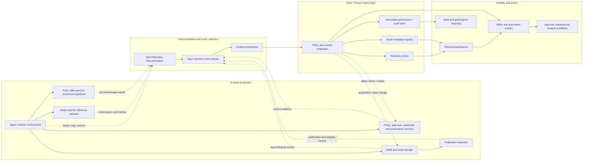
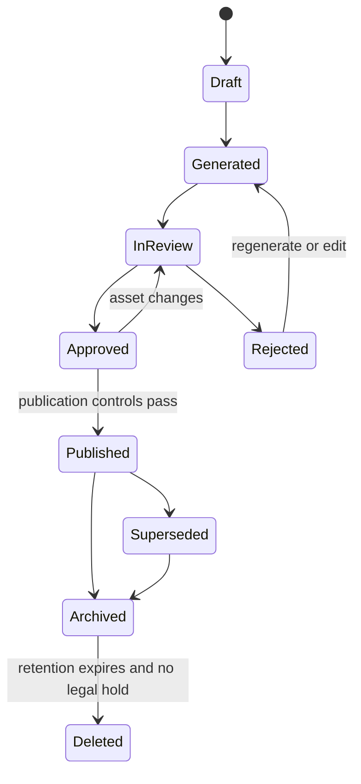

# Operation Silver Thread — how to understand and answer the screening task

This is a **standalone enterprise architecture case study**. It should not be
presented as a DocsMind feature or hidden inside an existing DocsMind topic.

DocsMind proves that you can build retrieval and GenAI systems. Operation
Silver Thread tests a different skill: whether you can make production AI
systems **visible, traceable, governable, and safe to operate** across technical
and business teams.

The final submission should still follow the brief exactly:

- one 3–5 page document with the six requested sections only;
- one 6–8 slide presentation;
- one architecture diagram;
- one telemetry and metadata model;
- one example trace;
- one dashboard and alerting model;
- one 90-day implementation plan.

This page is the thinking guide behind those deliverables. It explains what the
problem really is, how the proposed solution works, and why each major choice
is preferable to the alternatives.

> Security note: the supplied brief contains a repository password. Do not copy
> it into this page, slides, source control, screenshots, shell history, or the
> final submission. Because it has been pasted outside GitLab, rotate it before
> using the repository.

## 1. What is the screening task really asking?

Start with the lifecycle of one AI-generated asset:

```text
Request
  -> collect source material
  -> call agents, models, and tools
  -> generate or transform an asset
  -> check policy and quality
  -> add provenance and integrity evidence
  -> obtain approval
  -> store in the DAM
  -> publish
  -> transform, retain, archive, or delete later
```

The organisation already performs these steps. Its problem is that the steps
are not connected into one trustworthy record.

For example, a campaign image may exist in the Digital Asset Management system
(DAM), but nobody can quickly prove:

- which model created it;
- which prompt and source images were used;
- whether those source images allowed derivative use;
- whether a policy check passed;
- who approved the exact version that was published;
- whether the file changed after approval;
- whether provenance metadata or a watermark was added;
- whether the published file still matches the approved file;
- who owns the incident if any of those controls fail.

This creates three connected problems.

### Operational problem

Engineers cannot follow one workflow across agents, model endpoints, tools,
policy services, the DAM, and publication channels. A workflow may be slow or
stuck, but a normal infrastructure dashboard only shows that the individual
services are running.

### Governance problem

Legal, security, and business teams cannot prove that the required checks,
approvals, usage rights, and lifecycle rules were applied to the asset.

### Authenticity problem

The organisation cannot reliably prove that a published asset is the approved
asset or detect that somebody changed it later.

The task is therefore not “design a better Grafana dashboard.” It is:

> Design an operational control layer that connects an AI workflow to the
> asset it creates, preserves the evidence, checks whether the rules were
> followed, and causes the right action when they were not.

That sentence should be the centre of the submission.

## 2. Why traditional monitoring is not enough

Traditional monitoring answers infrastructure questions:

- Is the API up?
- What is its error rate?
- How much CPU or memory is it using?
- How long did the request take?

Those signals are still necessary, but they do not answer asset-level
questions:

- Which asset did this model call create?
- Was the prompt template approved for public content?
- Did the source asset have the right licence?
- Was human approval mandatory?
- Did the file change after approval?
- Should publication now be blocked?

The proposed layer joins four kinds of evidence:

| Evidence | Plain-language meaning | Example |
|---|---|---|
| Technical telemetry | What the software did | latency, error, retry, span |
| AI context | How the AI output was produced | model, prompt template, tool, dataset |
| Business and lifecycle context | What the output is and where it is going | campaign, asset version, DAM state, channel |
| Governance evidence | Whether required controls occurred | policy result, approval, provenance, hash |

The value comes from connecting them with shared identifiers such as
`trace_id`, `workflow_run_id`, `asset_id`, and `asset_version`.

Without that connection, the organisation has several dashboards and databases
but still no complete answer.

## 3. The proposed solution in one sentence

Instrument each AI asset workflow, emit correlated telemetry and lifecycle
events, enrich them with business and policy context, preserve the important
evidence, evaluate control rules at publication boundaries, and route failures
to the people or systems that can act.

The flow is:

```text
Observe -> Correlate -> Enrich -> Evaluate controls -> Preserve evidence -> Act
```

Each word has a specific purpose:

1. **Observe:** capture what agents, models, tools, pipelines, and DAM
   integrations do.
2. **Correlate:** connect every step to the same workflow and asset version.
3. **Enrich:** add ownership, campaign, sensitivity, lifecycle, and policy
   context.
4. **Evaluate controls:** decide whether the asset is allowed to progress.
5. **Preserve evidence:** store enough trustworthy history for audit and
   investigation.
6. **Act:** block, retry, request approval, open a ticket, quarantine an asset,
   or alert an owner.

This progression is important. Collecting data without control evaluation
creates passive reporting. Evaluating a rule without trustworthy evidence
creates an unreliable gate.

## 4. Target architecture

The architecture should remain vendor-neutral. The evaluator is looking for
clear boundaries and data flow, not a shopping list.



### How data moves through it

During generation, the agent runtime creates a root trace for the workflow.
Model calls, tool calls, data retrieval, policy checks, and DAM operations
become child spans. OpenTelemetry is a sensible instrumentation standard
because it gives the organisation a common trace model without locking the
design to one monitoring vendor.

Lifecycle changes are also emitted as events. Examples include
`asset.generated`, `policy.failed`, `approval.completed`,
`asset.published`, and `integrity.failed`. Events are useful because approval,
publication, and later transformations may happen minutes or days after the
original synchronous request.

The event stream buffers producers from consumers. The DAM does not have to
wait for dashboards, analytics, or governance reports to finish. Consumers can
independently update operational views, provenance records, alerts, and audit
reports.

The enrichment stage adds facts that raw telemetry does not know, such as the
business owner, campaign priority, content sensitivity, required policy pack,
approval rule, and retention class.

The policy and control layer then decides whether the workflow may continue.
For example, publication can be blocked when mandatory approval is missing,
provenance is incomplete, or an integrity check fails.

### Why an event-driven architecture?

The main alternative is direct point-to-point integration: every AI service
would call the dashboard, metadata database, alerting service, and audit store
itself.

That is initially simpler, but it creates tight coupling. A new audit consumer
would require changes in every producer. A slow dashboard could affect asset
generation. A temporary consumer failure could lose evidence.

An event stream is preferable because:

- producers publish once;
- several consumers can use the same event;
- consumers can recover and replay events;
- short failures do not have to lose audit evidence;
- the architecture can later include non-asset agent workflows.

The trade-off is more operational complexity. The 90-day pilot should therefore
use one workflow and a small set of events instead of attempting an
organisation-wide event taxonomy immediately.

### Why separate operational, metadata, and provenance stores?

The data has different access, retention, and query needs.

- **Telemetry store:** high-volume traces, logs, and metrics used for recent
  troubleshooting.
- **Metadata registry:** current searchable state for assets, owners, policy
  status, and lifecycle.
- **Provenance/audit store:** append-only or immutable evidence retained for
  investigation, legal needs, and verification.

Putting everything into one log platform looks convenient, but raw prompts,
security findings, long-retention audit evidence, and high-volume performance
metrics should not all have the same permissions or retention period.

### Where the real control points are

The strongest design does not apply every control at the end. It places checks
at the transition they protect:

| Transition | Required control examples | Failure action |
|---|---|---|
| Source selected -> generation begins | usage rights, sensitivity, source approval | reject source or require review |
| Model output -> candidate asset | content, safety, brand and quality checks | regenerate, reject, or review |
| Candidate -> approval | provenance completeness, watermark status, risk score | prevent submission |
| Approved -> published | exact-version approval, hash match, channel policy | block publication |
| Published -> transformed | new hash, derived-asset link, provenance preservation | quarantine derivative |
| Any state -> retained/deleted | retention rule, legal hold, authorised actor | block or audit exception |

This is why the solution is an operational control layer rather than a
dashboard.

## 5. Telemetry and metadata model

The final deliverable should show approximately 20 core fields, grouped by the
question they answer. A flat list is harder to understand.

| Group | Field | What it answers |
|---|---|---|
| Correlation | `trace_id` | Which end-to-end execution does this record belong to? |
| Correlation | `span_id` / `parent_span_id` | Which step is this, and what called it? |
| Correlation | `workflow_run_id` | Which business workflow instance ran? |
| AI execution | `agent_name` / `agent_version` | Which agent behaviour was deployed? |
| AI execution | `model_name` / `model_version` | Which model produced or evaluated the output? |
| AI execution | `prompt_template_id` / `prompt_template_version` | Which controlled prompt was used? |
| AI execution | `model_config_id` | Which temperature, decoding, and safety configuration applied? |
| Dependencies | `tool_name` / `tool_version` | Which external capability was called? |
| Dependencies | `data_source_id` | Which dataset or knowledge source contributed? |
| Asset | `asset_id` / `asset_version` | Which exact asset version is affected? |
| Asset | `source_asset_ids` | Which existing assets contributed to it? |
| Asset | `asset_type` / `generation_method` | What was produced, and was it generated, edited, or derived? |
| Business | `business_domain` / `business_entity_id` | Which product, campaign, or process is affected? |
| Lifecycle | `dam_state` / `published_location` | Where is the asset in its lifecycle and where is it exposed? |
| Operation | `timestamp` / `latency_ms` / `status` | When did the step run, how long did it take, and did it succeed? |
| Operation | `error_type` / `retry_count` | Why did it fail, and is it repeatedly failing? |
| Risk | `risk_score` / `policy_results` | How risky is it, and which checks passed or failed? |
| Approval | `approval_required` / `approval_status` / `approver_id` | Was review required, and who approved it? |
| Provenance | `provenance_record_id` / `watermark_status` | Is origin evidence attached and discoverable? |
| Integrity | `hash_algorithm` / `hash_value` / `integrity_status` | Does this file still match the trusted version? |
| Governance | `retention_policy_id` / `sensitivity_class` | How should the evidence and asset be protected and retained? |

In implementation, some table rows become multiple fields. The submission can
show 20 logical fields while noting that compound fields are normalised in the
real schema.

### Why these fields and not every possible field?

Each field must support at least one of four uses:

1. troubleshooting;
2. asset lineage and provenance;
3. control evaluation;
4. audit and lifecycle management.

Capturing everything increases cost and privacy risk. Capturing only
infrastructure metrics leaves governance blind. The chosen model is the minimum
useful connection between workflow, AI context, asset, control, and action.

### Separate identifiers from sensitive content

Most telemetry should contain stable references such as
`prompt_template_id`, `data_source_id`, or `provenance_record_id`, not the full
prompt, retrieved document, or generated asset.

The sensitive content can live in a protected store with narrower access,
shorter retention, encryption, redaction, and legal-hold rules. This allows an
operator to diagnose a failed model call without automatically seeing customer
or campaign content.

## 6. Example trace: campaign asset generation

The trace should demonstrate more than latency. Each span should produce
technical evidence and governance evidence.

```text
Generate campaign asset [trace_id=T-1042, asset_id=A-778, version=3]
├── Retrieve campaign brief
├── Retrieve brand guidelines
├── Fetch approved source image from DAM
├── Generate image variant
├── Run content and brand policy checks
├── Apply provenance metadata and watermark
├── Record cryptographic hash
├── Obtain human approval
├── Store approved version in DAM
└── Publish and verify published copy
```

The final submission only needs to explain 4–6 spans. These six provide a
complete story:

| Span | Signals captured | What can go wrong | Resulting action |
|---|---|---|---|
| Fetch source image | source ID/version, rights status, DAM latency | source lacks derivative rights or is superseded | stop generation and notify asset owner |
| Generate image | model/version, prompt template, config, latency, output reference | unapproved model or prompt version; model timeout | retry approved endpoint or quarantine output |
| Policy checks | policy pack/version, per-check result, risk score | brand, safety, privacy, or regulated-content failure | reject, regenerate, or require specialist review |
| Provenance and watermark | provenance ID, manifest status, watermark status | service unavailable or evidence incomplete | block approval or publication |
| Human approval | approver, role, evidence viewed, asset hash, timestamp | bypass, wrong role, or approval of an older version | block publication and open governance incident |
| Publish and verify | destination, published hash, publication status | file changed after approval or metadata stripped | unpublish/quarantine and investigate |

### Why trace the asset hash at approval?

An approval that says only “Ajmal approved asset A-778” is ambiguous if the
asset is edited later. The approval must bind the person and timestamp to the
exact asset version and hash.

That makes this sequence testable:

```text
hash at approval == hash before publication == hash after publication
```

A legitimate image transformation may change the hash. That does not
automatically mean tampering. It means the system must create a new derived
asset version, link it to its parent, reapply or preserve provenance, and run
the required controls again.

### Why use hashing, provenance metadata, and watermarking together?

They solve different problems:

- A **cryptographic hash** detects whether exact bytes changed.
- **Provenance metadata or content credentials** records origin, edits, and
  responsible parties in a verifiable form.
- A **watermark** provides a signal that may remain detectable when metadata is
  removed or content is redistributed.

Hashing alone cannot explain who created an asset. Metadata alone may be
stripped. A watermark alone does not describe the complete workflow or approval
history. The layered design is stronger than choosing only one.

## 7. Dashboards, alerts, and actions

One universal dashboard is not appropriate. Each persona sees different data,
has different authority, and makes different decisions.

### Technical Operations

**Metrics:** workflow success rate, p95 end-to-end latency, model/tool/DAM error
rate, retry rate, stuck workflow count, telemetry ingestion lag.

**Alerts:** DAM publication failure exceeds threshold; provenance or
watermarking dependency is unavailable; event ingestion is delayed beyond the
audit objective.

**Decisions:** retry or pause a workflow, fail over a dependency, open an
incident, or assign an engineering owner.

### Digital Asset and Business Operations

**Metrics:** assets generated by campaign and type, approval backlog, ageing by
priority, rejected asset rate, publication status, campaign assets at SLA risk.

**Alerts:** high-priority asset is waiting for approval; campaign publication is
blocked; approved asset was superseded before publication.

**Decisions:** reassign a reviewer, escalate an approval, adjust a campaign
schedule, or request regeneration.

### Security, Risk, Legal, and Compliance

**Metrics:** high-risk outputs, policy failures by rule, missing mandatory
approval, provenance gaps, integrity mismatches, sensitive-content access.

**Alerts:** approval bypass detected; hash mismatch after approval; restricted
content sent to an unapproved model endpoint; provenance missing at
publication.

**Decisions:** block or unpublish an asset, quarantine a collection, initiate an
investigation, preserve evidence, or require legal review.

### Executive Leadership

**Metrics:** overall workflow health, volume and cycle-time trend, percentage of
assets passing controls first time, business value or campaign throughput, risk
heatmap, cost trend.

**Alerts:** material risk spike; high-impact campaign blocked; repeated control
failure across a business unit.

**Decisions:** fund a reliability gap, pause a risky use case, change ownership,
or expand a proven workflow.

### Why alerts must include an action

An alert should contain:

- what happened;
- which asset, workflow, campaign, and channel are affected;
- the severity and supporting evidence;
- the current owner;
- the immediate safe action;
- a link to the trace, asset record, and runbook.

“Watermark failed” is noise. “Block publication of asset A-778 because the
mandatory watermark step failed; campaign owner and platform on-call notified”
is operationally useful.

## 8. Governance, security, and lifecycle controls

Governance is not a report produced after publication. It is the set of rules
that determines who may do what, what evidence must exist, and how the asset may
move between states.

### Asset state machine



Each transition needs:

- an authorised actor or service;
- the asset version and hash;
- a timestamp;
- the policy decision and evidence;
- the previous and new state;
- an immutable audit event.

An asset change after approval must invalidate or supersede the approval. This
is a critical depth signal because a simple approval flag does not protect a
mutable asset.

### Role-based access

Not every dashboard user should see:

- raw prompts or model outputs containing sensitive data;
- customer or regulated information;
- rejected outputs;
- legal comments;
- security findings and vulnerability details;
- internal detection rules;
- confidential campaign material.

Access should be based on role, business domain, sensitivity, and purpose.
Administrative access and reads of sensitive evidence must themselves be
audited.

### Safe prompt and output logging

The default should be structured metadata, not full-content logging.

When content is genuinely required for debugging or audit:

- redact known sensitive fields before ingestion;
- encrypt it in transit and at rest;
- keep it in a separate restricted store;
- use shorter retention than ordinary metadata;
- sample routine successful calls;
- retain failed or high-risk cases only under an approved rule;
- support legal hold without making all data permanent;
- record who accessed it and why.

Tokenisation or irreversible identifiers can support correlation without
exposing the original value.

### Provenance and immutable evidence

Important lifecycle events should be append-only. Corrections should create new
events rather than silently editing history.

Signed provenance records, restricted write permissions, encryption, and
tamper-evident storage make the evidence more trustworthy. Content credentials
can travel with the asset, while the internal provenance store preserves the
richer workflow history that should not be published.

### Five key risks and mitigations

| Risk | Why it matters | Mitigation |
|---|---|---|
| Sensitive content leaks into telemetry | Observability becomes a new data breach path | metadata-first logging, redaction, separation, RBAC, retention limits |
| Correlation breaks across systems | Nobody can reconstruct the end-to-end story | mandatory trace/workflow/asset IDs and integration contract tests |
| Asset changes after approval | Published content is not what the reviewer approved | bind approval to version and hash; invalidate on change |
| Controls become passive dashboard tiles | Risk is visible but the unsafe action still occurs | enforce policy gates at approval and publication |
| Too many noisy alerts | Teams ignore real incidents | severity, ownership, deduplication, SLOs, and action-oriented runbooks |

## 9. The first 90 days

The correct priority is not enterprise-wide coverage. It is proving one
end-to-end “silver thread” for one valuable asset workflow.

### Days 0–30: prove visibility

Choose one campaign asset workflow with a clear business owner.

Define the correlation IDs, core events, metadata fields, lifecycle states, and
control requirements. Instrument the most important model, tool, policy, DAM,
approval, and publication spans. Build one technical view and one asset
operations view.

**Exit evidence:**

- one asset can be followed from request to publication;
- the trace links to the exact DAM asset version;
- basic approval and policy events are visible;
- telemetry completeness and ingestion delay are measured.

### Days 31–60: turn visibility into control

Add business ownership, sensitivity, source rights, policy packs, approval
rules, provenance status, watermarks, and integrity hashes. Introduce focused
alerts and publication gates for the highest-risk failures. Separate sensitive
content from ordinary telemetry and apply role-based access.

**Exit evidence:**

- mandatory approval bypass is blocked;
- missing provenance or hash mismatch blocks publication;
- every high-severity alert has an owner and runbook;
- security, legal, DAM, and platform responsibilities are agreed.

### Days 61–90: harden and expand

Verify integrity again after transformation and publication. Add audit
reporting, retention and deletion evidence, replay/recovery tests, and a second
asset type or adjacent agent workflow. Measure alert quality and control
effectiveness before expanding further.

**Exit evidence:**

- an auditor can reconstruct one asset’s full history;
- a simulated tamper or approval-bypass scenario is detected and handled;
- recovery from telemetry consumer failure is tested;
- the pilot has measured SLOs and a prioritised scale-out plan.

### Why this order?

Automated controls built before reliable correlation can block the wrong asset.
Executive dashboards built before trustworthy evidence create false
confidence. Organisation-wide rollout before one end-to-end pilot creates a
large taxonomy project without proving value.

The sequence is therefore:

```text
Reliable evidence -> targeted control -> tested operations -> expansion
```

## 10. What the evaluator is likely measuring

The obvious question is “Can you draw the architecture?” The deeper questions
are:

- Can you distinguish infrastructure health from AI and asset governance?
- Can you trace one business object across asynchronous systems?
- Can you turn telemetry into a control and an owner action?
- Do you understand that approval belongs to an exact asset version?
- Can you separate integrity, provenance, and watermarking?
- Can you protect sensitive prompts and outputs from the observability system?
- Can you prioritise a realistic 90-day pilot?
- Can you make assumptions without hiding design gaps?

In an interview, the depth signal is not “I used OpenTelemetry, Kafka, and
Grafana.” It is:

> “I used a common trace context to connect the agent run to an exact DAM asset
> version. I used asynchronous lifecycle events because approval and
> publication outlive the model request. I bound approval to the asset hash,
> enforced the critical rules at publication, and separated sensitive content
> from operational telemetry.”

That explanation shows why the components exist and how their value would be
measured.

## 11. Assumptions to state in the submission

Keep assumptions short and concrete:

1. The DAM exposes asset/version APIs and lifecycle events or can be integrated
   through an adapter.
2. AI runtimes and model gateways can propagate a common trace context.
3. The pilot uses one high-value campaign workflow and one publication channel.
4. Existing identity, ticketing, approval, and monitoring platforms are reused.
5. Policy owners define which failures block, warn, or require human review.
6. Raw prompts and asset content are sensitive by default.
7. The design is vendor-neutral and integrates with the organisation’s current
   cloud and observability stack.

Assumptions prevent the architecture from pretending that every enterprise
system already behaves perfectly.

## 12. A practical 12-hour work plan

| Time | Work | Output |
|---|---|---|
| 0:00–1:00 | extract requirements, choose workflow, record assumptions | one-page decision skeleton |
| 1:00–3:00 | design control points and target architecture | architecture diagram and data-flow notes |
| 3:00–4:30 | define core schema and lifecycle events | 20-field model |
| 4:30–5:30 | build the example trace | trace tree and six span explanations |
| 5:30–7:00 | define persona dashboards, alerts, owners, and actions | dashboard matrix |
| 7:00–8:00 | design security, provenance, integrity, and lifecycle controls | governance section |
| 8:00–9:00 | create measurable 90-day plan | three-phase roadmap |
| 9:00–11:00 | write the 3–5 page document and derive slides from it | document and 6–8 slides |
| 11:00–12:00 | simplify, cross-check, rehearse, and remove secrets | final quality pass |

The document should be written first. The slides should compress the same
story, not introduce a second architecture.

## 13. Recommended final document flow

The submitted document must use the six headings requested by the brief.
Continuity comes from making each section answer the next natural question:

1. **Executive Point of View:** What problem are we solving, and what is the
   proposed control layer?
2. **Target Architecture:** What components make that control layer work?
3. **Telemetry, Trace, and Metadata Model:** What evidence flows through those
   components?
4. **Example Trace:** What does that evidence look like for one real asset?
5. **Dashboards, Alerts, and Actions:** How does the evidence help each person
   make a decision?
6. **Governance, Security, Lifecycle Controls, and 90-Day Plan:** How is the
   system protected, enforced, and introduced safely?

Useful transition sentences:

- Section 1 to 2: “With the control layer defined, the next question is how the
  evidence moves from production systems to decisions and actions.”
- Section 2 to 3: “The architecture only works if every component speaks a
  small, consistent correlation and asset metadata language.”
- Section 3 to 4: “The following campaign workflow shows how those fields join
  technical execution to the lifecycle of one asset.”
- Section 4 to 5: “Once the trace is connected to asset and policy context, the
  same evidence can drive different decisions for each operating persona.”
- Section 5 to 6: “Those actions are trustworthy only when access, approvals,
  evidence retention, and lifecycle transitions are governed explicitly.”

## 14. Recommended slide story

Use seven slides:

1. Problem and executive point of view.
2. One asset lifecycle and the missing “silver thread.”
3. Target architecture.
4. Telemetry/metadata model and example trace.
5. Control points: approval, provenance, integrity, and publication.
6. Persona dashboards, alerts, and actions.
7. Key risks, first 90 days, and expected outcomes.

Avoid a vendor-comparison slide. Put example technologies in small annotations
under the logical components. The architecture and operational reasoning should
remain the focus.

## 15. How to measure whether the solution worked

A proposal becomes stronger when the 90-day pilot has measurable success
criteria:

- percentage of pilot assets with complete end-to-end correlation;
- percentage with model, prompt, source, approval, and provenance evidence;
- telemetry ingestion delay and event-loss rate;
- workflow success rate and p95 completion time;
- percentage of mandatory control failures correctly blocked;
- mean time to detect and resolve a failed publication;
- approval backlog and median approval age;
- number of false-positive critical alerts;
- percentage of published assets passing post-publication integrity checks;
- time required to reconstruct one asset during an audit exercise.

This is the evidence to cite when asked, “How did you know the governance layer
worked?” Tool names do not answer that question; measured completeness,
detection, prevention, and recovery do.

## 16. Final recommendation

Treat Operation Silver Thread as its own small portfolio case study and keep
the submitted artefacts concise. Use this page as the detailed explanation
behind them.

The strongest submission will repeat one coherent story:

> Every AI-generated asset receives a silver thread connecting its workflow,
> model, prompt template, tools, sources, policy checks, provenance, integrity,
> approval, DAM state, and publication history. The organisation uses that
> thread not only to observe what happened, but to prevent unsafe transitions
> and route each exception to an accountable owner.

That directly answers the brief without turning the proposal into a generic
monitoring platform or a list of vendors.
